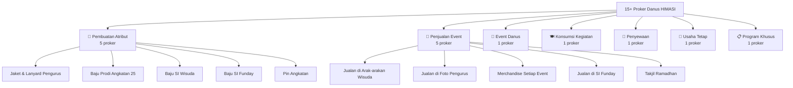

# 📊 Analisis Program Kerja Divisi Danus HIMASI

## Daftar Proker & Kategorisasi

| No | Nama Proker | Kategori | Tipe | Karakteristik |
|---|---|---|---|---|
| 1 | Pembuatan Jaket, Cocard, dan Lanyard Pengurus HIMASI | 🧥 Pembuatan Atribut | One-time | Jangka panjang, tergantung vendor |
| 2 | Pembuatan Baju Prodi Angkatan 25 | 🧥 Pembuatan Atribut | One-time | Jangka panjang, tergantung vendor |
| 3 | Pembuatan Baju SI Wisuda | 🧥 Pembuatan Atribut | One-time | Jangka panjang, tergantung vendor |
| 4 | Pembuatan Baju SI Funday | 🧥 Pembuatan Atribut | One-time | Jangka panjang, tergantung vendor |
| 5 | Pin Angkatan | 🧥 Pembuatan Atribut | One-time | Jangka panjang, tergantung vendor |
| 6 | Penjualan Minuman pada Latihan Arak-arakan Wisuda | 🛒 Penjualan Event | Recurring | Per event wisuda |
| 7 | Penjualan di Foto Pengurus Himpunan | 🛒 Penjualan Event | One-time | Sekali per kepengurusan |
| 8 | Penjualan Merchandise pada Setiap Event | 🛒 Penjualan Event | Recurring | Setiap ada event |
| 9 | Penjualan di SI Funday | 🛒 Penjualan Event | Recurring | Per event SI Funday |
| 10 | Takjil Ramadhan | 🛒 Penjualan Event | Seasonal | Khusus bulan Ramadhan |
| 11 | SI MARKET DAY | 🎪 Event Danus | One-time/Recurring | Event besar, perlu koordinasi banyak |
| 12 | Program Danus Konsumsi Kegiatan TDO | 🍽️ Konsumsi Kegiatan | One-time | Support event internal |
| 13 | Penyewaan Peralatan HIMASI | 🔧 Penyewaan | Ongoing | Berjalan terus sepanjang kepengurusan |
| 14 | Danus di Kantin Perintis | 🏪 Usaha Tetap | Ongoing | Operasional harian/rutin |
| 15 | Danus PMW (Program Mahasiswa Wirausaha) | 📋 Program Khusus | One-time | Proker program pemerintah |

---

## Ringkasan per Kategori

---

## Pola yang Saya Temukan

### ✅ Proker banyak tapi scope-nya kecil-kecil
> Ini berarti sistem harus **ringan dan cepat** untuk membuat proker baru. Tidak boleh terlalu ribet.

### ✅ Banyak proker tipe "Pembuatan Atribut" (5 dari 15)
> Butuh fitur **order tracking** yang kuat: siapa pesan, ukuran apa, sudah bayar belum, status produksi.

### ✅ Ada proker ongoing/rutin (Kantin, Penyewaan)
> Ini beda dari proker event — butuh **pencatatan transaksi harian** tanpa harus buat LPJ tiap hari.

### ✅ Banyak proker penjualan di event
> Butuh fitur **quick sales** — catat penjualan dengan cepat saat di lapangan (mungkin dari HP).

---

## Rekomendasi Penyesuaian Kategori di Sistem

Berdasarkan proker nyata, saya sarankan **6 kategori proker**:

| Kategori | Icon | Deskripsi | Fitur Khusus |
|---|---|---|---|
| **Pembuatan Atribut** | 🧥 | Baju, jaket, pin, dll — tergantung vendor | Order tracking (nama, ukuran, bayar, status produksi) |
| **Penjualan Event** | 🛒 | Jualan makanan/minuman/merch di event | Quick sales, rekap per event |
| **Event Danus** | 🎪 | Event yang diorganisir divisi danus | Task management, koordinasi tim |
| **Konsumsi Kegiatan** | 🍽️ | Menyediakan konsumsi untuk kegiatan internal | RAB sederhana, catat pengeluaran |
| **Penyewaan** | 🔧 | Penyewaan peralatan HIMASI | Log penyewaan (siapa, kapan, barang apa) |
| **Usaha Tetap** | 🏪 | Usaha rutin/harian (kantin, dll) | Pencatatan harian, tidak perlu LPJ per transaksi |
