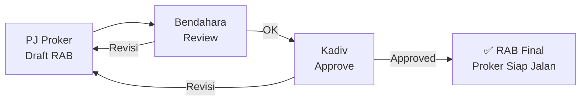
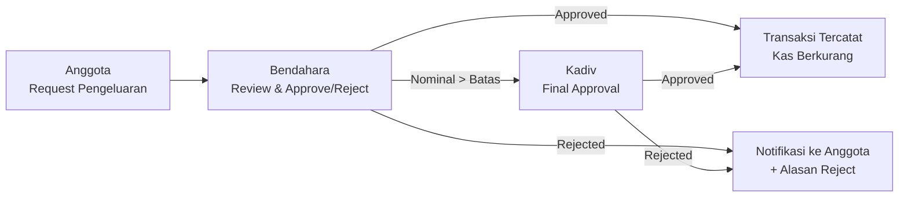

# 🏗️ Brainstorming: Sistem Internal Divisi Danus HIMASI

> **Nama Proyek**: Danus HIMASI Management System
> **Tech Stack**: Laravel (PHP) + MySQL + Blade/Livewire
> **Aktor**: Kadiv, Sekretaris, Bendahara, Anggota (6–10 orang)

---

## 📌 Ringkasan Kebutuhan

| Aspek | Detail |
|---|---|
| **Aktivitas Utama** | Jualan produk, pengelolaan kas, event danus, pembuatan atribut (PDH, kaos) |
| **Pain Points** | Tracking keuangan sulit, koordinasi berantakan, tidak ada rekap stok/penjualan, progress proyek tak terpantau, laporan manual, kurang transparan |
| **Jumlah User** | 6–10 anggota + Kadiv + Sekretaris + Bendahara |

---

## 👥 Definisi Aktor & Peran

| Role | Deskripsi | Tanggung Jawab Utama di Sistem |
|---|---|---|
| **Kadiv** | Ketua Divisi — pemimpin & pengambil keputusan | Full access, approve proyek, assign PIC, oversight seluruh sistem |
| **Sekretaris** | Administrasi & dokumentasi divisi | Kelola notulensi rapat, pengumuman, rekap data anggota, generate laporan |
| **Bendahara** | Pengelola keuangan divisi | Kelola kas, catat & approve transaksi, rekap keuangan, laporan keuangan |
| **Anggota** | Pelaksana kegiatan danus | Eksekusi tugas, catat penjualan, update progress, request pengeluaran |

### 🔐 Matrix Hak Akses

| Fitur | Kadiv | Sekretaris | Bendahara | Anggota |
|---|:---:|:---:|:---:|:---:|
| Manage User & Role | ✅ | ❌ | ❌ | ❌ |
| CRUD Proyek | ✅ | 👁️ View | 👁️ View | 👁️ View |
| Assign PIC Proyek | ✅ | ❌ | ❌ | ❌ |
| Draft RAB | ✅ | ❌ | ❌ | ✅ (sebagai PIC) |
| Review RAB | ✅ | ❌ | ✅ | ❌ |
| Approve RAB | ✅ | ❌ | ❌ | ❌ |
| Buat LPJ (Realisasi + Evaluasi) | ✅ | ❌ | ❌ | ✅ (sebagai PJ) |
| Lihat Riwayat LPJ | ✅ | 👁️ View | ✅ | 👁️ View |
| Lihat RAB vs Realisasi | ✅ | 👁️ View | ✅ | 👁️ View |
| Buat & Assign Tugas | ✅ | ✅ | ❌ | ❌ |
| Update Status Tugas | ✅ | ✅ | ✅ | ✅ (milik sendiri) |
| Catat Pemasukan | ✅ | ❌ | ✅ | ❌ |
| Catat Pengeluaran | ✅ | ❌ | ✅ | 📝 Request |
| Approve Pengeluaran | ✅ | ❌ | ✅ | ❌ |
| Lihat Kas & Saldo | ✅ | 👁️ View | ✅ | 👁️ View |
| Kelola Produk & Stok | ✅ | ❌ | ❌ | ✅ |
| Catat Penjualan | ✅ | ❌ | ✅ | ✅ |
| Kelola Order Atribut | ✅ | ✅ | ✅ | ✅ |
| Buat Pengumuman | ✅ | ✅ | ❌ | ❌ |
| Catat Notulensi Rapat | ✅ | ✅ | ❌ | ❌ |
| Generate Laporan | ✅ | ✅ | ✅ | ❌ |
| Export PDF/Excel | ✅ | ✅ | ✅ | ❌ |
| Dashboard Overview | ✅ Full | ✅ Administrasi | ✅ Keuangan | ✅ Personal |

---

## 🎯 Modul & Fitur Sistem

### 1. 🔐 Modul Autentikasi & Manajemen User

| Fitur | Deskripsi | Aktor |
|---|---|---|
| Login/Logout | Autentikasi (email/password) | Semua |
| Profil User | Nama, NIM, kontak, foto | Semua |
| Role Management | Assign role: Kadiv / Sekretaris / Bendahara / Anggota | Kadiv |
| Manage Anggota | CRUD data anggota divisi | Kadiv |

---

### 2. 📦 Modul Proyek Danus

> Setiap kegiatan danus (jualan, event, pembuatan atribut) dibungkus dalam **"Proyek"**

| Fitur | Deskripsi | Aktor |
|---|---|---|
| Buat Proyek Baru | Nama, deskripsi, kategori (Jualan/Event/Atribut), target dana, deadline | Kadiv |
| Detail Proyek | Dashboard per proyek — progress, keuangan, tugas | Semua |
| Status Proyek | Draft → Aktif → Selesai → Diarsipkan | Kadiv |
| Assign PIC | Tetapkan Person in Charge per proyek | Kadiv |
| Timeline / Milestone | Tahapan proyek dengan target tanggal | Kadiv, Sekretaris |
| Kategori Proyek | **Jualan Produk**, **Event Danus**, **Atribut** (PDH/Kaos) | — |

#### 💡 Contoh Proyek:
- "Jualan Coklat Valentine" — kategori: Jualan Produk
- "Bazar Makanan Dies Natalis" — kategori: Event Danus
- "Pembuatan PDH Angkatan 2026" — kategori: Atribut

---

### 3. 📋 Modul RAB (Rencana Anggaran Biaya)

> **RAB = rencana sebelum proker jalan.** Disusun oleh PJ, di-review Bendahara, di-approve Kadiv.

| Fitur | Deskripsi | Aktor |
|---|---|---|
| Buat Draft RAB | PJ menyusun rencana anggaran (item, jumlah, harga satuan) | PJ Proker (Anggota) |
| Item RAB | Daftar kebutuhan: nama item, qty, satuan, harga satuan, subtotal | PJ Proker |
| Kategori Item | Kelompokkan item: Bahan Baku, Operasional, Perlengkapan, Lain-lain | PJ Proker |
| Total RAB | Auto-hitung total anggaran dari seluruh item | Otomatis |
| Review RAB | Bendahara memeriksa kelayakan anggaran, bisa minta revisi | Bendahara |
| Approve RAB | Kadiv menyetujui RAB final | Kadiv |
| Status RAB | Draft → Reviewed → Approved | — |

#### 💡 Flow RAB:

---

### 4. 📄 Modul LPJ (Laporan Pertanggungjawaban)

> **LPJ = laporan progresif selama proker berjalan.** Bisa ada **banyak LPJ** per proker — dibuat bertahap sesuai progress di lapangan.

| Fitur | Deskripsi | Aktor |
|---|---|---|
| Buat LPJ | PJ membuat entry LPJ baru (bisa berkali-kali per proker) | PJ Proker (Anggota) |
| Realisasi Anggaran | Input pengeluaran aktual per item RAB (qty, harga, bukti) | PJ Proker |
| Catatan Evaluasi | Kendala, solusi, pembelajaran, saran untuk ke depan | PJ Proker |
| Lampiran Bukti | Upload foto nota/struk/bukti sebagai lampiran | PJ Proker |
| RAB vs Realisasi | Perbandingan otomatis: rencana vs aktual (hemat/over-budget) | Semua |
| Riwayat LPJ | Timeline semua LPJ per proker (dari awal sampai selesai) | Semua |
| Status LPJ | Draft → Submitted → Reviewed | — |

#### 💡 Contoh LPJ — Proker Recurring (Jualan Wisuda):

> Proker "Jualan di Acara Wisuda" terjadi beberapa kali dalam masa kepengurusan

| LPJ ke- | Event | Realisasi | Catatan Evaluasi |
|---|---|---|---|
| #1 | Wisuda Maret | Rp 450.000 / RAB Rp 500.000 | ✅ Lancar, stok habis. Tambah qty berikutnya |
| #2 | Wisuda Juli | Rp 520.000 / RAB Rp 500.000 | ⚠️ Over budget, harga bahan naik |
| #3 | Wisuda November | Rp 480.000 / RAB Rp 550.000 | ✅ Sudah adjust, profit lebih baik |

#### 💡 Contoh LPJ — Proker Jangka Panjang (Baju JAHIM):

> Proker "Pembuatan Baju JAHIM" memakan waktu lama & tergantung vendor

| LPJ ke- | Tahap | Catatan Evaluasi |
|---|---|---|
| #1 | Survei & Pilih Vendor | ✅ Vendor A dipilih, harga cocok dengan RAB |
| #2 | Bahan Tidak Sesuai ⚠️ | 🔴 Bahan tidak sesuai sampel. Nego ulang, biaya tambahan Rp 200.000 |
| #3 | Produksi Ulang | ⚠️ Vendor ganti bahan, timeline mundur 2 minggu |
| #4 | Selesai ✅ | ✅ Selesai & didistribusikan. Realisasi Rp 2.3jt vs RAB Rp 2jt (over Rp 300rb karena kendala bahan) |

#### 💡 Tabel RAB vs Realisasi (Auto-generated dari semua LPJ):

| Item | Qty RAB | Harga RAB | Subtotal RAB | Qty Aktual | Harga Aktual | Subtotal Aktual | Selisih |
|---|---|---|---|---|---|---|---|
| Kain utama | 20 m | Rp 50.000 | Rp 1.000.000 | 22 m | Rp 55.000 | Rp 1.210.000 | 🔴 +Rp 210.000 |
| Sablon | 30 pcs | Rp 25.000 | Rp 750.000 | 30 pcs | Rp 25.000 | Rp 750.000 | ⚪ Rp 0 |
| Packaging | 30 pcs | Rp 5.000 | Rp 150.000 | 30 pcs | Rp 4.500 | Rp 135.000 | 🟢 -Rp 15.000 |
| **TOTAL** | | | **Rp 2.000.000** | | | **Rp 2.300.000** | **🔴 +Rp 300.000** |

---

### 5. ✅ Modul Task Management (Koordinasi Tugas)

> Menggantikan koordinasi via chat group yang berantakan

| Fitur | Deskripsi | Aktor |
|---|---|---|
| Buat Tugas | Judul, deskripsi, deadline, prioritas (High/Medium/Low) | Kadiv, Sekretaris |
| Assign Tugas | Tetapkan tugas ke anggota tertentu | Kadiv, Sekretaris |
| Update Status | To Do → In Progress → Done | Semua (tugas sendiri) |
| Kanban Board | Visualisasi tugas seperti Trello | Semua |
| Komentar Tugas | Diskusi per tugas (mengurangi noise di chat) | Semua |
| My Tasks | Anggota bisa lihat semua tugas yang di-assign ke mereka | Semua |
| Notifikasi | Alert ketika ada tugas baru / mendekati deadline | Semua |

---

### 6. 💰 Modul Keuangan (Kas & Transaksi)

> Core module — dikelola oleh **Bendahara**, diawasi oleh **Kadiv**

| Fitur | Deskripsi | Aktor |
|---|---|---|
| Kas Divisi | Saldo kas divisi secara real-time | Semua (view), Bendahara (manage) |
| Catat Pemasukan | Input pemasukan + kategori + bukti transfer (upload foto) | Bendahara, Kadiv |
| Catat Pengeluaran | Input pengeluaran + kategori + bukti (nota/struk) | Bendahara, Kadiv |
| Keuangan Per Proyek | Setiap proyek punya "sub-kas" sendiri | Semua (view) |
| Profit/Loss Per Proyek | Otomatis hitung laba/rugi per proyek danus | Semua |
| Riwayat Transaksi | Log transaksi dengan filter (tanggal, proyek, kategori) | Semua |
| Request Pengeluaran | Anggota ajukan request pengeluaran | Anggota |
| Approval Pengeluaran | Bendahara review → approve/reject (Kadiv juga bisa) | Bendahara, Kadiv |
| Upload Bukti | Lampirkan foto nota/struk/bukti transfer | Semua |

#### 💡 Flow Approval Pengeluaran:

---

### 7. 🛒 Modul Penjualan & Stok

> Menggantikan pencatatan penjualan via WhatsApp. **Semua anggota bisa melihat** pemasukan & pengeluaran.

| Fitur | Deskripsi | Aktor |
|---|---|---|
| **Katalog Produk** | Daftar produk per proker (nama, harga modal, harga jual, foto, stok) | Kadiv, Anggota |
| **Catat Pemasukan** | Input: produk, qty, total nominal | Semua Anggota |
| **Catat Pengeluaran** | Input: item, qty, total nominal + bukti nota | Bendahara, Anggota |
| **Manajemen Stok** | Stok otomatis berkurang saat jual, bertambah saat restock | Otomatis |
| **Low Stock Alert** | Notifikasi ketika stok menipis, perlu restock | Kadiv, Bendahara |
| **Laporan Profit/Loss** | Otomatis hitung: Total Pemasukan - Total Pengeluaran = Laba/Rugi | Semua (view) |
| **Riwayat Transaksi** | Log semua pemasukan & pengeluaran, bisa difilter | Semua (view) |
| **Rekap per Proker** | Summary pemasukan, pengeluaran, laba/rugi per proker | Semua (view) |

#### 💡 Contoh: Proker "Penjualan Merchandise"

| Tanggal | Tipe | Keterangan | Nominal | Dicatat oleh |
|---|---|---|---|---|
| 1 Sep 2026 | 💸 Pengeluaran | Beli Ganci 50 pcs + Stiker 100 pcs | Rp 600.000 | Fika |
| 15 Sep 2026 | 💰 Pemasukan | Jual Ganci & Stiker di event | Rp 130.000 | Wisnu |
| 20 Sep 2026 | 💸 Pengeluaran | Restock Ganci 30 pcs | Rp 240.000 | Fika |
| 30 Sep 2026 | 💰 Pemasukan | Jual Ganci & Stiker di event | Rp 177.000 | Wisnu |

**Laporan Profit/Loss (Auto-generated):**

| | Jumlah |
|---|---|
| 💰 Total Pemasukan | Rp 307.000 |
| 💸 Total Pengeluaran | Rp 840.000 |
| 📊 **Laba / Rugi** | **🔴 -Rp 533.000** |
| 📦 Sisa Stok Ganci | 22 pcs |
| 📦 Sisa Stok Stiker | 84 pcs |

> [!NOTE]
> **Catatan detail** (metode bayar, kendala, dll) dicatat di **LPJ** sebagai progres proker — bukan di setiap transaksi. Transaksi hanya fokus ke **nominal masuk/keluar**.

---

### 8. 📦 Modul Order Atribut

> Khusus proker pembuatan atribut (baju, jaket, pin) — tracking pesanan dari mahasiswa

| Fitur | Deskripsi | Aktor |
|---|---|---|
| Input Pesanan | Nama pemesan, item, ukuran, jumlah | Semua Anggota |
| Status Bayar | Belum Bayar → DP → Lunas | Semua Anggota |
| Status Produksi | Dipesan → Diproses Vendor → Selesai → Diambil | Kadiv, PJ Proker |
| Rekap Pesanan | Total pesanan per ukuran, total yang sudah bayar | Semua (view) |
| Export Data | Export daftar pesanan ke Excel (untuk kirim ke vendor) | Kadiv, Sekretaris |

---

### 9. 📊 Modul Dashboard & Laporan

> Transparansi dan pelaporan ke BPH — setiap role punya dashboard yang berbeda

| Fitur | Deskripsi | Aktor |
|---|---|---|
| **Dashboard Kadiv** | Overview lengkap: total kas, semua proyek, semua tugas, grafik keuangan, performa anggota | Kadiv |
| **Dashboard Sekretaris** | Ringkasan tugas, notulensi terbaru, pengumuman, rekap anggota | Sekretaris |
| **Dashboard Bendahara** | Fokus keuangan: saldo kas, pemasukan/pengeluaran terkini, pending approval, grafik P/L | Bendahara |
| **Dashboard Anggota** | My tasks, proyek yang diikuti, penjualan hari ini | Anggota |
| Laporan Keuangan | Generate laporan keuangan per proyek / per periode | Bendahara, Sekretaris, Kadiv |
| Laporan Aktivitas | Rangkuman kegiatan divisi per periode | Sekretaris, Kadiv |
| Grafik & Chart | Visualisasi pemasukan vs pengeluaran, trend penjualan | Semua |
| Export PDF/Excel | Export data untuk laporan ke BPH | Kadiv, Sekretaris, Bendahara |

---

### 10. 📢 Modul Pengumuman & Dokumentasi

| Fitur | Deskripsi | Aktor |
|---|---|---|
| Pengumuman | Posting pengumuman internal divisi | Kadiv, Sekretaris |
| Feed Aktivitas | Log aktivitas terbaru (siapa melakukan apa) | Semua |
| Catatan Rapat | Notulensi rapat divisi, bisa di-attach ke proyek | Kadiv, Sekretaris |
| Arsip Dokumen | Upload & kelola dokumen divisi (proposal, surat, dll) | Kadiv, Sekretaris |

---

## 🗂️ Arsitektur Data (Entity Relationship)

```mermaid
erDiagram
    USER ||--o{ PROJECT_MEMBER : "bergabung"
    USER ||--o{ TASK : "ditugaskan"
    USER ||--o{ TRANSACTION : "mencatat"
    USER ||--o{ SALE : "mencatat"
    USER ||--o{ ANNOUNCEMENT : "membuat"
    USER ||--o{ MEETING_NOTE : "mencatat"
    
    PROJECT ||--o{ PROJECT_MEMBER : "memiliki"
    PROJECT ||--o{ TASK : "memiliki"
    PROJECT ||--o{ TRANSACTION : "memiliki"
    PROJECT ||--o{ PRODUCT : "memiliki"
    PROJECT ||--o{ MILESTONE : "memiliki"
    PROJECT ||--o{ MEETING_NOTE : "memiliki"
    
    PRODUCT ||--o{ SALE : "terjual"
    PRODUCT ||--o{ STOCK_MOVEMENT : "pergerakan"
    PRODUCT ||--o{ ORDER_ITEM : "dipesan"
    
    ORDER ||--o{ ORDER_ITEM : "berisi"
    
    TRANSACTION ||--o{ TRANSACTION_APPROVAL : "memiliki"
    
    PROJECT ||--o{ RAB : "memiliki"
    RAB ||--o{ RAB_ITEM : "berisi"
    RAB ||--o{ RAB_APPROVAL : "memiliki"
    PROJECT ||--o{ LPJ : "memiliki"
    LPJ ||--o{ LPJ_REALISASI : "berisi"
    LPJ_REALISASI }o--|| RAB_ITEM : "mereferensi"
    
    USER {
        int id PK
        string name
        string nim
        string email
        string password
        enum role "kadiv|sekretaris|bendahara|anggota"
        string phone
        string photo
    }
    
    PROJECT {
        int id PK
        string name
        string description
        enum category "jualan|event|atribut"
        decimal target_amount
        enum status "draft|active|completed|archived"
        date start_date
        date end_date
        int created_by FK
    }
    
    PROJECT_MEMBER {
        int id PK
        int project_id FK
        int user_id FK
        boolean is_pic
    }
    
    TASK {
        int id PK
        int project_id FK
        int assigned_to FK
        int created_by FK
        string title
        text description
        enum status "todo|in_progress|done"
        enum priority "low|medium|high"
        date deadline
    }
    
    TRANSACTION {
        int id PK
        int project_id FK
        int user_id FK
        enum type "income|expense"
        decimal amount
        string category
        string description
        string proof_file
        enum status "pending|approved|rejected"
        datetime created_at
    }
    
    TRANSACTION_APPROVAL {
        int id PK
        int transaction_id FK
        int approved_by FK
        enum action "approved|rejected"
        text note
        datetime created_at
    }
    
    PRODUCT {
        int id PK
        int project_id FK
        string name
        decimal cost_price
        decimal sell_price
        int current_stock
        int min_stock
        string photo
    }
    
    SALE {
        int id PK
        int product_id FK
        int user_id FK
        int quantity
        decimal total_price
        string buyer_name
        enum payment_method "cash|transfer"
        datetime created_at
    }
    
    STOCK_MOVEMENT {
        int id PK
        int product_id FK
        int user_id FK
        enum type "in|out"
        int quantity
        string note
        datetime created_at
    }
    
    ORDER {
        int id PK
        int project_id FK
        string customer_name
        string customer_contact
        enum status "unpaid|paid|processing|completed"
        decimal total_amount
        datetime created_at
    }
    
    ORDER_ITEM {
        int id PK
        int order_id FK
        int product_id FK
        int quantity
        string size
        string notes
    }
    
    MILESTONE {
        int id PK
        int project_id FK
        string title
        date target_date
        boolean is_completed
    }
    
    ANNOUNCEMENT {
        int id PK
        int user_id FK
        string title
        text content
        boolean is_pinned
        datetime created_at
    }
    
    MEETING_NOTE {
        int id PK
        int project_id FK
        int user_id FK
        string title
        text content
        date meeting_date
        string attachment
    }
    
    DOCUMENT {
        int id PK
        int user_id FK
        int project_id FK
        string title
        string file_path
        string file_type
        datetime created_at
    }
    
    RAB {
        int id PK
        int project_id FK
        int created_by FK
        string version
        decimal total_amount
        enum status "draft|reviewed|approved|revision|active|completed"
        text notes
        datetime created_at
    }
    
    RAB_ITEM {
        int id PK
        int rab_id FK
        string item_name
        enum category "bahan_baku|operasional|perlengkapan|lainnya"
        int quantity
        string unit
        decimal unit_price
        decimal subtotal
    }
    
    RAB_APPROVAL {
        int id PK
        int rab_id FK
        int user_id FK
        enum action "reviewed|approved|revision_requested"
        text note
        datetime created_at
    }
    
    LPJ {
        int id PK
        int project_id FK
        int created_by FK
        string title
        int lpj_number
        text catatan_evaluasi
        text kendala
        text solusi
        enum status "draft|submitted|reviewed"
        datetime created_at
    }
    
    LPJ_REALISASI {
        int id PK
        int lpj_id FK
        int rab_item_id FK
        int actual_quantity
        decimal actual_unit_price
        decimal actual_subtotal
        string proof_file
        text note
    }
```

---

## 🛠️ Tech Stack Detail

| Layer | Teknologi |
|---|---|
| **Backend** | Laravel 11 (PHP 8.2+) |
| **Frontend** | Blade + Livewire 3 (reactive tanpa SPA complexity) |
| **UI Framework** | Tailwind CSS + Flowbite/daisyUI components |
| **Database** | MySQL (via Laragon) |
| **Auth** | Laravel Breeze (simple auth scaffolding) |
| **File Upload** | Laravel Storage (local disk) |
| **Charts** | Chart.js / ApexCharts |
| **Export** | Laravel Excel (Maatwebsite) + DomPDF |
| **Realtime** | Laravel Echo + Pusher (opsional, untuk notifikasi) |

---

## 📋 Prioritas Pengembangan (Roadmap)

### 🟢 Phase 1 — Foundation (Sprint 1–2)
> **Fokus**: Login, role system, kelola proyek, dan keuangan dasar

- [ ] Setup Laravel project
- [ ] Autentikasi (Login/Register)
- [ ] Manajemen User & Role (Kadiv/Sekretaris/Bendahara/Anggota)
- [ ] CRUD Proyek Danus
- [ ] Modul RAB (draft, review, approve) + Item RAB
- [ ] Modul LPJ (realisasi anggaran + catatan evaluasi + kendala)
- [ ] Perbandingan RAB vs Realisasi (auto-generated dari LPJ)
- [ ] Modul Keuangan dasar (catat pemasukan/pengeluaran per proyek)
- [ ] Dashboard per role (sederhana)

### 🟡 Phase 2 — Koordinasi (Sprint 3–4)
> **Fokus**: Task management & dokumentasi

- [ ] Task Management + Kanban Board
- [ ] Assign tugas ke anggota
- [ ] Pengumuman internal (Sekretaris)
- [ ] Catatan Rapat (Sekretaris)
- [ ] Feed aktivitas

### 🟠 Phase 3 — Penjualan & Stok (Sprint 5–6)
> **Fokus**: Fitur jualan dan order atribut

- [ ] Katalog Produk + Manajemen Stok
- [ ] Pencatatan Penjualan
- [ ] Order Atribut (PDH/Kaos) + Tracking Pesanan
- [ ] Rekap Penjualan

### 🔴 Phase 4 — Reporting & Polish (Sprint 7–8)
> **Fokus**: Laporan, approval flow, dan finishing

- [ ] Laporan Keuangan (PDF/Excel export) — Bendahara & Sekretaris
- [ ] Laporan Aktivitas — Sekretaris
- [ ] Grafik & Visualisasi data
- [ ] Approval flow pengeluaran (Anggota → Bendahara → Kadiv)
- [ ] Arsip Dokumen
- [ ] Polish UI/UX

---

## 🔑 Unique Value Proposition

| Masalah Lama | Solusi di Sistem |
|---|---|
| Tracking keuangan di Excel/kertas | 💰 **Bendahara** punya dashboard keuangan real-time per proyek |
| Koordinasi via chat group (pesan tenggelam) | ✅ **Task board** — Kadiv & Sekretaris assign tugas dengan jelas |
| Rekap stok manual, sering salah | 📦 **Stok otomatis** berkurang saat penjualan dicatat |
| Progress proyek tidak jelas | 📊 **Dashboard per role** — setiap orang lihat info yang relevan |
| Laporan ke BPH ribet, copy-paste | 📄 **Sekretaris & Bendahara** auto-generate laporan PDF/Excel |
| Anggota tidak tahu kondisi kas | 🔍 **Transparansi** — semua bisa lihat saldo & riwayat |
| Notulensi rapat hilang di chat | 📝 **Sekretaris** catat notulensi yang tersimpan rapi & ter-link ke proyek |
| Pengeluaran tidak terkontrol | ✅ **Approval flow** — Anggota request → Bendahara approve → Kadiv final |

---

> [!IMPORTANT]
> Dokumen ini adalah hasil brainstorming. Setelah disetujui, kita akan mulai **Phase 1** — setup Laravel project dan membangun fondasi sistem dengan 4 role (Kadiv, Sekretaris, Bendahara, Anggota).
