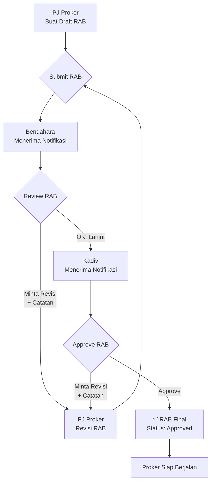
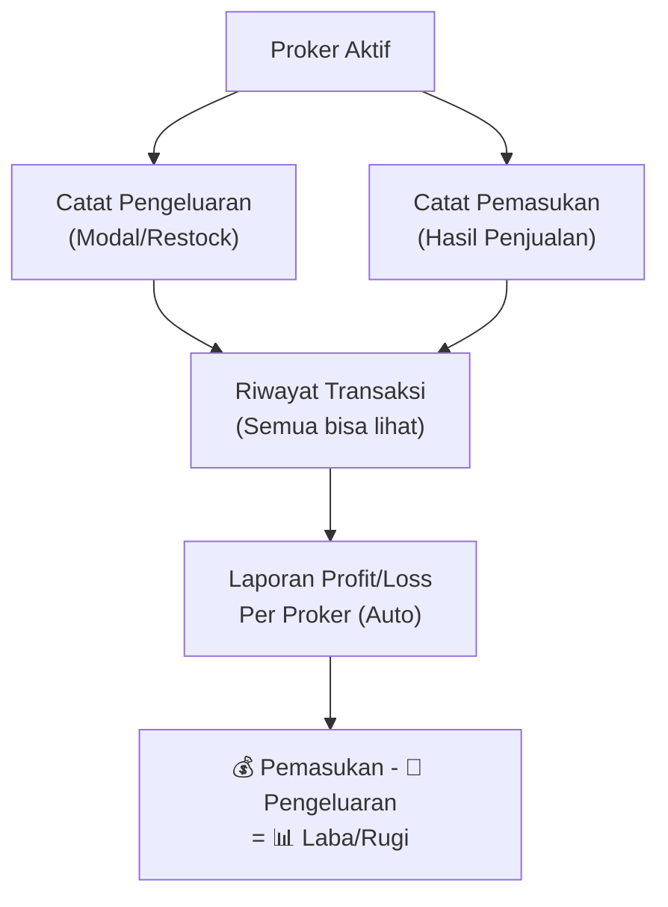
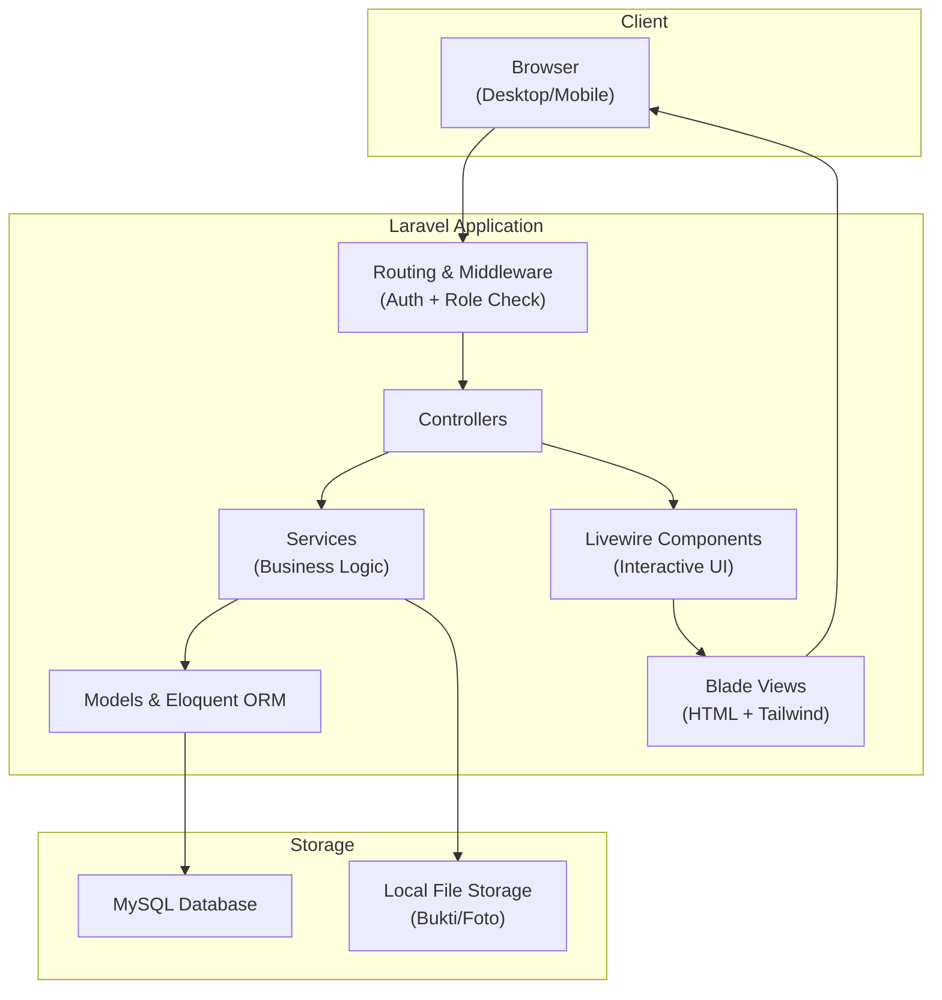

# 📄 Product Requirements Document (PRD)
# Sistem Internal Divisi Danus HIMASI

| Field | Detail |
|---|---|
| **Nama Produk** | Danus HIMASI Management System |
| **Versi Dokumen** | 1.0 |
| **Tanggal** | 1 Oktober 2026 |
| **Author** | Kadiv Danus HIMASI |
| **Status** | Draft — Menunggu Approval |

---

## 1. Latar Belakang

### 1.1 Konteks Organisasi
Divisi Dana Usaha (Danus) merupakan divisi di Himpunan Mahasiswa Sistem Informasi (HIMASI) yang bertanggung jawab atas pengelolaan dan pencarian dana untuk kegiatan himpunan. Divisi ini memiliki **15+ program kerja** dengan skala kecil namun berjumlah banyak, mencakup penjualan merchandise, pembuatan atribut, event danus, hingga usaha tetap.

### 1.2 Masalah yang Dihadapi

| No | Masalah | Dampak |
|---|---|---|
| 1 | Pencatatan keuangan manual (Excel/kertas) | Data tidak real-time, rentan human error, sulit di-rekap |
| 2 | Koordinasi tugas via WhatsApp group | Pesan tenggelam, tugas tidak tertrack, tidak ada deadline jelas |
| 3 | Pencatatan penjualan via chat WA | Tidak ada rekap penjualan/stok yang rapi, sulit hitung profit |
| 4 | Progress proker tidak terpantau | Kadiv sulit mengetahui status terkini setiap proker |
| 5 | Laporan ke BPH/Himpunan manual | Copy-paste data dari berbagai sumber, memakan waktu |
| 6 | Kurangnya transparansi keuangan | Anggota tidak tahu kondisi kas dan transaksi terkini |
| 7 | Notulensi rapat hilang di chat | Tidak ada dokumentasi keputusan rapat yang tersimpan rapi |

### 1.3 Tujuan Proyek
Membangun **ekosistem digital internal** Divisi Danus yang mengintegrasikan seluruh aktivitas divisi — dari perencanaan proker, penganggaran (RAB), pelaksanaan, pencatatan keuangan, hingga pelaporan (LPJ) — dalam satu platform terpadu.

### 1.4 Sasaran (Goals)

| Goal | Metrik Keberhasilan |
|---|---|
| Digitalisasi pencatatan keuangan | 100% transaksi tercatat di sistem, bukan di WA/Excel |
| Transparansi keuangan | Semua anggota bisa melihat pemasukan & pengeluaran real-time |
| Efisiensi koordinasi | Tugas ter-assign jelas dengan deadline & status tracking |
| Akuntabilitas proker | Setiap proker punya RAB (rencana) dan LPJ (realisasi + evaluasi) |
| Pelaporan otomatis | Generate laporan keuangan & aktivitas dalam format PDF/Excel |

---

## 2. Ruang Lingkup (Scope)

### 2.1 Dalam Scope (In-Scope)

- Manajemen user dengan 4 role (Kadiv, Sekretaris, Bendahara, Anggota)
- Manajemen proker (program kerja) dengan 6 kategori
- RAB (Rencana Anggaran Biaya) dengan approval flow bertingkat
- LPJ (Laporan Pertanggungjawaban) progresif — multiple entry per proker
- Pencatatan keuangan (pemasukan & pengeluaran) per proker
- Manajemen produk & stok untuk proker penjualan
- Order tracking untuk proker pembuatan atribut
- Task management dengan kanban board
- Dashboard per role
- Laporan & export PDF/Excel
- Pengumuman & notulensi rapat

### 2.2 Luar Scope (Out-of-Scope)

- Integrasi payment gateway (pembayaran tetap manual)
- Aplikasi mobile native (menggunakan responsive web)
- Multi-organisasi (sistem hanya untuk 1 divisi danus)
- Integrasi WhatsApp / Telegram bot
- E-commerce / toko online publik

---

## 3. Aktor & Persona

### 3.1 Kadiv (Ketua Divisi)

| Aspek | Detail |
|---|---|
| **Deskripsi** | Pemimpin divisi, pengambil keputusan tertinggi |
| **Jumlah** | 1 orang |
| **Kebutuhan** | Melihat overview seluruh proker, approve RAB, assign PJ, monitor keuangan |
| **Akses** | Full access ke seluruh fitur |

### 3.2 Sekretaris

| Aspek | Detail |
|---|---|
| **Deskripsi** | Pengelola administrasi & dokumentasi divisi |
| **Jumlah** | 1 orang |
| **Kebutuhan** | Membuat pengumuman, catat notulensi, kelola tugas, generate laporan |
| **Akses** | Administrasi, task management, dokumentasi, laporan |

### 3.3 Bendahara

| Aspek | Detail |
|---|---|
| **Deskripsi** | Pengelola keuangan divisi |
| **Jumlah** | 1 orang |
| **Kebutuhan** | Kelola kas, review RAB, approve pengeluaran, rekap keuangan |
| **Akses** | Keuangan, review RAB, approval transaksi, laporan keuangan |

### 3.4 Anggota

| Aspek | Detail |
|---|---|
| **Deskripsi** | Pelaksana kegiatan danus, bisa menjadi PJ (Penanggung Jawab) proker |
| **Jumlah** | 6–10 orang |
| **Kebutuhan** | Eksekusi tugas, catat penjualan, draft RAB (sebagai PJ), buat LPJ (sebagai PJ) |
| **Akses** | Tugas sendiri, catat penjualan, view keuangan, draft RAB & LPJ jika sebagai PJ |

### 3.5 Matrix Hak Akses

| Fitur | Kadiv | Sekretaris | Bendahara | Anggota |
|---|:---:|:---:|:---:|:---:|
| Manage User & Role | ✅ | ❌ | ❌ | ❌ |
| CRUD Proker | ✅ | 👁️ | 👁️ | 👁️ |
| Assign PJ Proker | ✅ | ❌ | ❌ | ❌ |
| Draft RAB | ✅ | ❌ | ❌ | ✅ (PJ) |
| Review RAB | ✅ | ❌ | ✅ | ❌ |
| Approve RAB | ✅ | ❌ | ❌ | ❌ |
| Buat LPJ | ✅ | ❌ | ❌ | ✅ (PJ) |
| Lihat Riwayat LPJ | ✅ | 👁️ | ✅ | 👁️ |
| Lihat RAB vs Realisasi | ✅ | 👁️ | ✅ | 👁️ |
| Buat & Assign Tugas | ✅ | ✅ | ❌ | ❌ |
| Update Status Tugas | ✅ | ✅ | ✅ | ✅ (sendiri) |
| Catat Pemasukan | ✅ | ❌ | ✅ | ✅ |
| Catat Pengeluaran | ✅ | ❌ | ✅ | 📝 Request |
| Approve Pengeluaran | ✅ | ❌ | ✅ | ❌ |
| Lihat Kas & Transaksi | ✅ | 👁️ | ✅ | 👁️ |
| Kelola Produk & Stok | ✅ | ❌ | ❌ | ✅ |
| Kelola Order Atribut | ✅ | ✅ | ✅ | ✅ |
| Buat Pengumuman | ✅ | ✅ | ❌ | ❌ |
| Catat Notulensi | ✅ | ✅ | ❌ | ❌ |
| Generate Laporan | ✅ | ✅ | ✅ | ❌ |
| Export PDF/Excel | ✅ | ✅ | ✅ | ❌ |

---

## 4. Kategori Program Kerja

Berdasarkan analisis 15+ proker nyata Divisi Danus HIMASI:

| No | Kategori | Icon | Contoh Proker | Fitur Khusus |
|---|---|---|---|---|
| 1 | **Pembuatan Atribut** | 🧥 | Jaket Pengurus, Baju Prodi, Baju Wisuda, Baju Funday, Pin Angkatan | Order tracking, status produksi vendor |
| 2 | **Penjualan Event** | 🛒 | Jualan Wisuda, Merchandise Event, Takjil Ramadhan, Jualan SI Funday | Catat penjualan cepat, stok tracking |
| 3 | **Event Danus** | 🎪 | SI Market Day | Task management, koordinasi tim |
| 4 | **Konsumsi Kegiatan** | 🍽️ | Konsumsi TDO | RAB sederhana, catat pengeluaran |
| 5 | **Penyewaan** | 🔧 | Penyewaan Peralatan HIMASI | Log penyewaan |
| 6 | **Usaha Tetap** | 🏪 | Danus Kantin Perintis, Danus PMW | Pencatatan harian |

---

## 5. Functional Requirements

### FR-01: Autentikasi & Manajemen User

| ID | Requirement | Prioritas |
|---|---|---|
| FR-01-01 | Sistem harus menyediakan halaman login dengan email dan password | P0 |
| FR-01-02 | Sistem harus mendukung 4 role: Kadiv, Sekretaris, Bendahara, Anggota | P0 |
| FR-01-03 | Kadiv dapat membuat, mengedit, dan menghapus akun anggota | P0 |
| FR-01-04 | Kadiv dapat mengubah role user (assign sebagai Sekretaris/Bendahara) | P0 |
| FR-01-05 | Setiap user memiliki profil (nama, NIM, email, phone, foto) | P1 |
| FR-01-06 | Sistem harus redirect user ke dashboard sesuai role setelah login | P0 |

**User Stories:**
- Sebagai **Kadiv**, saya ingin menambahkan anggota baru ke sistem agar mereka bisa mengakses fitur divisi.
- Sebagai **Anggota**, saya ingin login dengan email & password agar bisa mengakses tugas dan proker saya.

---

### FR-02: Manajemen Proker (Program Kerja)

| ID | Requirement | Prioritas |
|---|---|---|
| FR-02-01 | Kadiv dapat membuat proker baru dengan nama, deskripsi, kategori (6 jenis), target dana, dan tanggal mulai/selesai | P0 |
| FR-02-02 | Kadiv dapat assign 1 atau lebih anggota sebagai PJ (Penanggung Jawab) proker | P0 |
| FR-02-03 | Proker memiliki status: Draft → Aktif → Selesai → Diarsipkan | P0 |
| FR-02-04 | Semua user dapat melihat daftar proker dan detail proker | P0 |
| FR-02-05 | Detail proker menampilkan: info umum, RAB, LPJ, keuangan (pemasukan/pengeluaran), dan tugas | P0 |
| FR-02-06 | Proker dapat difilter berdasarkan kategori dan status | P1 |
| FR-02-07 | Proker memiliki milestone/tahapan dengan target tanggal | P2 |

**User Stories:**
- Sebagai **Kadiv**, saya ingin membuat proker "Pembuatan Baju SI Wisuda" dan assign Wisnu sebagai PJ, agar proker terkelola dengan jelas.
- Sebagai **Anggota**, saya ingin melihat daftar semua proker yang aktif agar tahu apa saja yang sedang berjalan.

---

### FR-03: RAB (Rencana Anggaran Biaya)

| ID | Requirement | Prioritas |
|---|---|---|
| FR-03-01 | PJ proker dapat membuat draft RAB berisi daftar item (nama, kategori, qty, satuan, harga satuan) | P0 |
| FR-03-02 | Subtotal per item dan total RAB dihitung otomatis | P0 |
| FR-03-03 | Item RAB dapat dikategorikan: Bahan Baku, Operasional, Perlengkapan, Lain-lain | P1 |
| FR-03-04 | RAB memiliki status: Draft → Reviewed → Approved | P0 |
| FR-03-05 | Bendahara dapat me-review RAB dan meminta revisi dengan catatan | P0 |
| FR-03-06 | Kadiv dapat meng-approve RAB yang sudah di-review Bendahara | P0 |
| FR-03-07 | PJ dapat merevisi RAB yang diminta revisi | P0 |
| FR-03-08 | RAB yang sudah approved tidak bisa diubah (harus ajukan revisi baru) | P1 |

**User Flow:**

**Acceptance Criteria:**
- [ ] PJ dapat menambah/edit/hapus item RAB selama status masih Draft
- [ ] Total RAB auto-update saat item ditambah/diubah/dihapus
- [ ] Bendahara mendapat notifikasi saat RAB di-submit
- [ ] Kadiv mendapat notifikasi saat RAB lolos review Bendahara
- [ ] Catatan revisi tersimpan dan bisa dilihat PJ

---

### FR-04: LPJ (Laporan Pertanggungjawaban)

| ID | Requirement | Prioritas |
|---|---|---|
| FR-04-01 | PJ proker dapat membuat entry LPJ baru (multiple LPJ per proker) | P0 |
| FR-04-02 | Setiap LPJ memiliki: judul, nomor urut (auto), catatan evaluasi, kendala, solusi | P0 |
| FR-04-03 | LPJ berisi realisasi anggaran — input pengeluaran aktual per item RAB | P0 |
| FR-04-04 | PJ dapat upload bukti (foto nota/struk) sebagai lampiran LPJ | P1 |
| FR-04-05 | Sistem menampilkan perbandingan RAB vs Realisasi otomatis (dari akumulasi semua LPJ) | P0 |
| FR-04-06 | Selisih per item ditampilkan: hemat (🟢), sesuai (⚪), over-budget (🔴) | P1 |
| FR-04-07 | Semua user dapat melihat riwayat/timeline LPJ per proker | P0 |
| FR-04-08 | LPJ memiliki status: Draft → Submitted → Reviewed | P1 |

**User Stories:**
- Sebagai **PJ proker "Baju JAHIM"**, saya ingin membuat LPJ #2 untuk melaporkan bahwa bahan dari vendor tidak sesuai dan ada biaya tambahan Rp 200.000, agar Kadiv dan tim mengetahui kendala ini.
- Sebagai **Kadiv**, saya ingin melihat perbandingan RAB vs Realisasi proker "Jualan Wisuda" agar tahu apakah proker ini sesuai anggaran.

**Acceptance Criteria:**
- [ ] PJ dapat membuat LPJ baru kapan saja selama proker aktif
- [ ] Nomor LPJ auto-increment per proker (#1, #2, #3, ...)
- [ ] Realisasi anggaran ter-link ke item RAB yang sudah disetujui
- [ ] Tabel RAB vs Realisasi menampilkan perbandingan kumulatif dari semua LPJ
- [ ] Timeline LPJ menampilkan semua entry secara kronologis

---

### FR-05: Task Management

| ID | Requirement | Prioritas |
|---|---|---|
| FR-05-01 | Kadiv dan Sekretaris dapat membuat tugas (judul, deskripsi, deadline, prioritas) | P1 |
| FR-05-02 | Tugas dapat di-assign ke anggota tertentu | P1 |
| FR-05-03 | Tugas memiliki status: To Do → In Progress → Done | P1 |
| FR-05-04 | Tugas memiliki prioritas: Low, Medium, High | P1 |
| FR-05-05 | Tugas dapat dihubungkan ke proker tertentu | P1 |
| FR-05-06 | Tampilan kanban board (drag & drop antar status) | P2 |
| FR-05-07 | User dapat menambahkan komentar pada tugas | P2 |
| FR-05-08 | Setiap user dapat melihat daftar "My Tasks" (tugas yang di-assign ke mereka) | P1 |

---

### FR-06: Keuangan (Kas & Transaksi)

| ID | Requirement | Prioritas |
|---|---|---|
| FR-06-01 | Sistem menampilkan saldo kas divisi secara real-time | P0 |
| FR-06-02 | Bendahara/Kadiv dapat mencatat pemasukan dengan keterangan dan bukti | P0 |
| FR-06-03 | Bendahara/Kadiv dapat mencatat pengeluaran dengan keterangan dan bukti | P0 |
| FR-06-04 | Setiap transaksi terhubung ke proker tertentu | P0 |
| FR-06-05 | Sistem menampilkan profit/loss per proker otomatis | P0 |
| FR-06-06 | Anggota dapat request pengeluaran, Bendahara/Kadiv approve/reject | P1 |
| FR-06-07 | Riwayat transaksi dapat difilter per tanggal, proker, dan tipe (masuk/keluar) | P1 |
| FR-06-08 | **Semua anggota dapat melihat** riwayat pemasukan & pengeluaran (transparansi) | P0 |
| FR-06-09 | Upload bukti transaksi (foto nota/struk/bukti transfer) | P1 |

**User Flow — Pencatatan Keuangan Proker:**

---

### FR-07: Penjualan & Stok

| ID | Requirement | Prioritas |
|---|---|---|
| FR-07-01 | User dapat mendaftarkan produk per proker (nama, harga modal, harga jual, foto, stok awal) | P1 |
| FR-07-02 | Semua anggota dapat mencatat penjualan (produk, qty, total nominal) | P1 |
| FR-07-03 | Stok otomatis berkurang saat penjualan dicatat | P1 |
| FR-07-04 | Stok otomatis bertambah saat restock dicatat | P1 |
| FR-07-05 | Sistem menampilkan notifikasi low stock ketika stok di bawah minimum | P2 |
| FR-07-06 | Laporan profit/loss per produk otomatis | P1 |
| FR-07-07 | Riwayat transaksi penjualan & restock dapat difilter | P2 |

> [!NOTE]
> Metode pembayaran (Cash/QRIS/Transfer) **tidak perlu di-pisah** di pencatatan transaksi. Catatan detail seperti metode bayar dicatat di **LPJ** sebagai progres proker.

---

### FR-08: Order Atribut

| ID | Requirement | Prioritas |
|---|---|---|
| FR-08-01 | User dapat input pesanan atribut (nama pemesan, item, ukuran, jumlah) | P1 |
| FR-08-02 | Pesanan memiliki status bayar: Belum Bayar → DP → Lunas | P1 |
| FR-08-03 | Pesanan memiliki status produksi: Dipesan → Diproses Vendor → Selesai → Diambil | P1 |
| FR-08-04 | Sistem menampilkan rekap pesanan per ukuran dan total pembayaran | P1 |
| FR-08-05 | Data pesanan dapat di-export ke Excel (untuk dikirim ke vendor) | P2 |

---

### FR-09: Dashboard & Laporan

| ID | Requirement | Prioritas |
|---|---|---|
| FR-09-01 | **Dashboard Kadiv**: overview total kas, proker aktif, tugas pending, grafik keuangan | P0 |
| FR-09-02 | **Dashboard Sekretaris**: ringkasan tugas, notulensi, pengumuman terbaru | P1 |
| FR-09-03 | **Dashboard Bendahara**: saldo kas, transaksi terkini, pending approval, grafik P/L | P0 |
| FR-09-04 | **Dashboard Anggota**: my tasks, proker yang diikuti | P1 |
| FR-09-05 | Generate laporan keuangan per proker/periode dalam format PDF | P2 |
| FR-09-06 | Generate laporan keuangan per proker/periode dalam format Excel | P2 |
| FR-09-07 | Grafik visualisasi: pemasukan vs pengeluaran, trend per bulan | P2 |

---

### FR-10: Pengumuman & Dokumentasi

| ID | Requirement | Prioritas |
|---|---|---|
| FR-10-01 | Kadiv/Sekretaris dapat membuat pengumuman internal | P2 |
| FR-10-02 | Pengumuman dapat di-pin agar selalu tampil di atas | P2 |
| FR-10-03 | Kadiv/Sekretaris dapat mencatat notulensi rapat, ter-link ke proker | P2 |
| FR-10-04 | Feed aktivitas menampilkan log aksi terbaru di sistem | P2 |
| FR-10-05 | Upload & kelola arsip dokumen divisi (proposal, surat) | P3 |

---

## 6. Non-Functional Requirements

| ID | Requirement | Detail |
|---|---|---|
| NFR-01 | **Responsif** | Tampilan harus responsive di desktop dan mobile (karena anggota catat penjualan dari HP di lapangan) |
| NFR-02 | **Performa** | Halaman harus load dalam < 3 detik pada koneksi normal |
| NFR-03 | **Keamanan** | Password di-hash (bcrypt), session management, CSRF protection |
| NFR-04 | **Authorization** | Setiap endpoint harus di-protect sesuai role (middleware) |
| NFR-05 | **Data Backup** | Database di-backup secara berkala (manual, via Laragon) |
| NFR-06 | **File Storage** | Upload file (bukti, foto) disimpan di local storage, max 2MB per file |
| NFR-07 | **Browser Support** | Chrome, Firefox, Safari, Edge (versi terbaru) |
| NFR-08 | **Bahasa** | Seluruh UI dalam Bahasa Indonesia |

---

## 7. Database Schema

### 7.1 Daftar Tabel

| No | Tabel | Deskripsi | Relasi Utama |
|---|---|---|---|
| 1 | `users` | Data pengguna sistem | - |
| 2 | `projects` | Program kerja (proker) | → users (created_by) |
| 3 | `project_members` | Anggota & PJ per proker | → projects, users |
| 4 | `rabs` | RAB (Rencana Anggaran Biaya) | → projects, users |
| 5 | `rab_items` | Item detail RAB | → rabs |
| 6 | `rab_approvals` | Log review/approve RAB | → rabs, users |
| 7 | `lpjs` | Laporan Pertanggungjawaban | → projects, users |
| 8 | `lpj_realisasis` | Realisasi anggaran per item | → lpjs, rab_items |
| 9 | `tasks` | Tugas / to-do | → projects, users |
| 10 | `transactions` | Transaksi keuangan (masuk/keluar) | → projects, users |
| 11 | `transaction_approvals` | Log approval transaksi | → transactions, users |
| 12 | `products` | Katalog produk per proker | → projects |
| 13 | `sales` | Catatan penjualan | → products, users |
| 14 | `stock_movements` | Pergerakan stok (masuk/keluar) | → products, users |
| 15 | `orders` | Pesanan atribut | → projects |
| 16 | `order_items` | Detail item pesanan | → orders, products |
| 17 | `milestones` | Tahapan proker | → projects |
| 18 | `announcements` | Pengumuman internal | → users |
| 19 | `meeting_notes` | Notulensi rapat | → projects, users |
| 20 | `documents` | Arsip dokumen | → projects, users |

### 7.2 Detail Field per Tabel

#### `users`
| Field | Type | Constraint | Keterangan |
|---|---|---|---|
| id | bigint | PK, auto-increment | |
| name | varchar(255) | required | Nama lengkap |
| nim | varchar(20) | required, unique | Nomor Induk Mahasiswa |
| email | varchar(255) | required, unique | Untuk login |
| password | varchar(255) | required | Hashed (bcrypt) |
| role | enum | required | `kadiv`, `sekretaris`, `bendahara`, `anggota` |
| phone | varchar(20) | nullable | Nomor HP |
| photo | varchar(255) | nullable | Path foto profil |
| created_at | timestamp | auto | |
| updated_at | timestamp | auto | |

#### `projects`
| Field | Type | Constraint | Keterangan |
|---|---|---|---|
| id | bigint | PK | |
| name | varchar(255) | required | Nama proker |
| description | text | nullable | Deskripsi proker |
| category | enum | required | `pembuatan_atribut`, `penjualan_event`, `event_danus`, `konsumsi_kegiatan`, `penyewaan`, `usaha_tetap` |
| target_amount | decimal(15,2) | nullable | Target dana |
| status | enum | required, default: draft | `draft`, `active`, `completed`, `archived` |
| start_date | date | nullable | Tanggal mulai |
| end_date | date | nullable | Tanggal selesai |
| created_by | bigint | FK → users | Kadiv yang membuat |
| created_at | timestamp | auto | |
| updated_at | timestamp | auto | |

#### `project_members`
| Field | Type | Constraint | Keterangan |
|---|---|---|---|
| id | bigint | PK | |
| project_id | bigint | FK → projects | |
| user_id | bigint | FK → users | |
| is_pic | boolean | default: false | PJ (Penanggung Jawab) |
| created_at | timestamp | auto | |

#### `rabs`
| Field | Type | Constraint | Keterangan |
|---|---|---|---|
| id | bigint | PK | |
| project_id | bigint | FK → projects | |
| created_by | bigint | FK → users | PJ yang membuat |
| version | varchar(10) | default: "1.0" | Versi RAB |
| total_amount | decimal(15,2) | default: 0 | Auto-calculated |
| status | enum | required | `draft`, `reviewed`, `approved` |
| notes | text | nullable | Catatan umum |
| created_at | timestamp | auto | |
| updated_at | timestamp | auto | |

#### `rab_items`
| Field | Type | Constraint | Keterangan |
|---|---|---|---|
| id | bigint | PK | |
| rab_id | bigint | FK → rabs | |
| item_name | varchar(255) | required | Nama item |
| category | enum | required | `bahan_baku`, `operasional`, `perlengkapan`, `lainnya` |
| quantity | int | required | Jumlah |
| unit | varchar(50) | required | Satuan (pcs, m, kg, set, dll) |
| unit_price | decimal(15,2) | required | Harga satuan |
| subtotal | decimal(15,2) | required | Auto: qty × unit_price |

#### `rab_approvals`
| Field | Type | Constraint | Keterangan |
|---|---|---|---|
| id | bigint | PK | |
| rab_id | bigint | FK → rabs | |
| user_id | bigint | FK → users | Reviewer/Approver |
| action | enum | required | `reviewed`, `approved`, `revision_requested` |
| note | text | nullable | Catatan review |
| created_at | timestamp | auto | |

#### `lpjs`
| Field | Type | Constraint | Keterangan |
|---|---|---|---|
| id | bigint | PK | |
| project_id | bigint | FK → projects | |
| created_by | bigint | FK → users | PJ yang membuat |
| title | varchar(255) | required | Judul LPJ |
| lpj_number | int | required | Auto-increment per proker |
| catatan_evaluasi | text | nullable | Evaluasi umum |
| kendala | text | nullable | Kendala yang dihadapi |
| solusi | text | nullable | Solusi yang dilakukan |
| status | enum | default: draft | `draft`, `submitted`, `reviewed` |
| created_at | timestamp | auto | |
| updated_at | timestamp | auto | |

#### `lpj_realisasis`
| Field | Type | Constraint | Keterangan |
|---|---|---|---|
| id | bigint | PK | |
| lpj_id | bigint | FK → lpjs | |
| rab_item_id | bigint | FK → rab_items | Referensi ke item RAB |
| actual_quantity | int | required | Qty aktual |
| actual_unit_price | decimal(15,2) | required | Harga aktual |
| actual_subtotal | decimal(15,2) | required | Auto-calculated |
| proof_file | varchar(255) | nullable | Bukti (foto nota) |
| note | text | nullable | Catatan per item |

#### `transactions`
| Field | Type | Constraint | Keterangan |
|---|---|---|---|
| id | bigint | PK | |
| project_id | bigint | FK → projects | |
| user_id | bigint | FK → users | Yang mencatat |
| type | enum | required | `income`, `expense` |
| amount | decimal(15,2) | required | Nominal |
| description | varchar(500) | required | Keterangan |
| proof_file | varchar(255) | nullable | Bukti |
| status | enum | default: approved | `pending`, `approved`, `rejected` |
| created_at | timestamp | auto | |
| updated_at | timestamp | auto | |

#### `products`
| Field | Type | Constraint | Keterangan |
|---|---|---|---|
| id | bigint | PK | |
| project_id | bigint | FK → projects | |
| name | varchar(255) | required | Nama produk |
| cost_price | decimal(15,2) | required | Harga modal |
| sell_price | decimal(15,2) | required | Harga jual |
| current_stock | int | default: 0 | Stok saat ini |
| min_stock | int | default: 5 | Batas minimum stok |
| photo | varchar(255) | nullable | Foto produk |
| created_at | timestamp | auto | |
| updated_at | timestamp | auto | |

#### `orders`
| Field | Type | Constraint | Keterangan |
|---|---|---|---|
| id | bigint | PK | |
| project_id | bigint | FK → projects | |
| customer_name | varchar(255) | required | Nama pemesan |
| customer_contact | varchar(100) | nullable | Kontak pemesan |
| payment_status | enum | default: unpaid | `unpaid`, `dp`, `paid` |
| production_status | enum | default: ordered | `ordered`, `processing`, `completed`, `picked_up` |
| total_amount | decimal(15,2) | default: 0 | |
| created_at | timestamp | auto | |
| updated_at | timestamp | auto | |

---

## 8. Tech Stack & Arsitektur

| Layer | Teknologi | Alasan |
|---|---|---|
| **Backend** | Laravel 11 (PHP 8.2+) | Framework PHP terpopuler, MVC, ecosystem kaya |
| **Frontend** | Blade + Livewire 3 | Reactive UI tanpa complexity SPA |
| **CSS** | Tailwind CSS 3 | Utility-first, cepat untuk styling |
| **UI Components** | Flowbite / daisyUI | Pre-built components untuk Tailwind |
| **Database** | MySQL 8.0 | Reliable, sudah tersedia di Laragon |
| **Auth** | Laravel Breeze | Simple auth scaffolding |
| **File Upload** | Laravel Storage (local) | Simpel, tanpa cloud dependency |
| **Charts** | Chart.js / ApexCharts | Visualisasi data keuangan |
| **Export** | Maatwebsite Excel + DomPDF | Export laporan ke Excel & PDF |
| **Dev Server** | Laragon | Local development environment |

### Arsitektur Aplikasi:

---

## 9. Roadmap Pengembangan

### 🟢 Phase 1 — Foundation (Sprint 1–2)
> **Target**: Sistem bisa dipakai untuk kelola proker + RAB + LPJ + keuangan dasar

| No | Task | Estimasi |
|---|---|---|
| 1 | Setup Laravel project + Tailwind + Livewire | 1 hari |
| 2 | Autentikasi (login/register) + seeder user awal | 1 hari |
| 3 | Manajemen User & Role (CRUD + assign role) | 2 hari |
| 4 | CRUD Proker (6 kategori) + assign PJ | 3 hari |
| 5 | Modul RAB (draft, item, review, approve) | 4 hari |
| 6 | Modul LPJ (buat entry, realisasi, evaluasi) | 4 hari |
| 7 | RAB vs Realisasi (auto-generated) | 2 hari |
| 8 | Modul Keuangan (catat pemasukan/pengeluaran per proker) | 3 hari |
| 9 | Dashboard per role (sederhana) | 2 hari |

### 🟡 Phase 2 — Koordinasi (Sprint 3–4)
> **Target**: Task management + komunikasi internal

| No | Task | Estimasi |
|---|---|---|
| 1 | Task Management (CRUD + assign + status) | 3 hari |
| 2 | Kanban Board (drag & drop) | 2 hari |
| 3 | Pengumuman internal | 1 hari |
| 4 | Catatan Rapat / Notulensi | 2 hari |
| 5 | Feed aktivitas | 2 hari |

### 🟠 Phase 3 — Penjualan & Order (Sprint 5–6)
> **Target**: Fitur jualan + order atribut

| No | Task | Estimasi |
|---|---|---|
| 1 | Katalog Produk + Manajemen Stok | 3 hari |
| 2 | Pencatatan Penjualan + auto stok | 2 hari |
| 3 | Order Atribut + tracking pesanan | 3 hari |
| 4 | Rekap Penjualan + Profit/Loss | 2 hari |

### 🔴 Phase 4 — Reporting & Polish (Sprint 7–8)
> **Target**: Laporan, export, dan finishing

| No | Task | Estimasi |
|---|---|---|
| 1 | Laporan Keuangan (PDF export) | 3 hari |
| 2 | Laporan Keuangan (Excel export) | 2 hari |
| 3 | Grafik & visualisasi dashboard | 3 hari |
| 4 | Approval flow pengeluaran | 2 hari |
| 5 | Arsip Dokumen | 1 hari |
| 6 | UI/UX Polish + responsive mobile | 3 hari |
| 7 | Testing & bug fixes | 3 hari |

---

## 10. Prioritas Fitur

| Prioritas | Label | Deskripsi | Modul |
|---|---|---|---|
| **P0** | Must Have | Fitur wajib ada untuk MVP | Auth, Proker, RAB, LPJ, Keuangan, Dashboard |
| **P1** | Should Have | Penting tapi bisa rilis tanpa ini | Task, Penjualan, Order Atribut, Profil |
| **P2** | Nice to Have | Menambah value tapi tidak urgent | Kanban, Charts, Export, Notifikasi |
| **P3** | Future | Untuk pengembangan selanjutnya | Arsip Dokumen, Feed Aktivitas |

---

> [!IMPORTANT]
> Dokumen PRD ini adalah **acuan utama (source of truth)** untuk seluruh proses pengembangan. Setiap perubahan requirement harus di-update di dokumen ini terlebih dahulu sebelum diimplementasikan.
